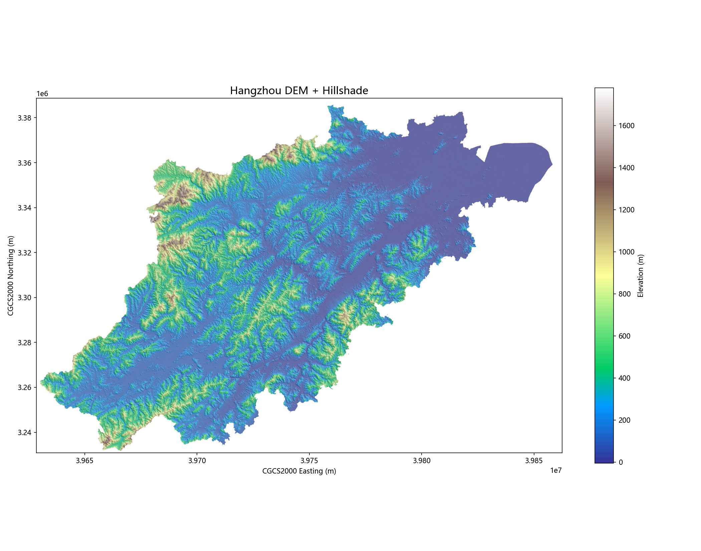
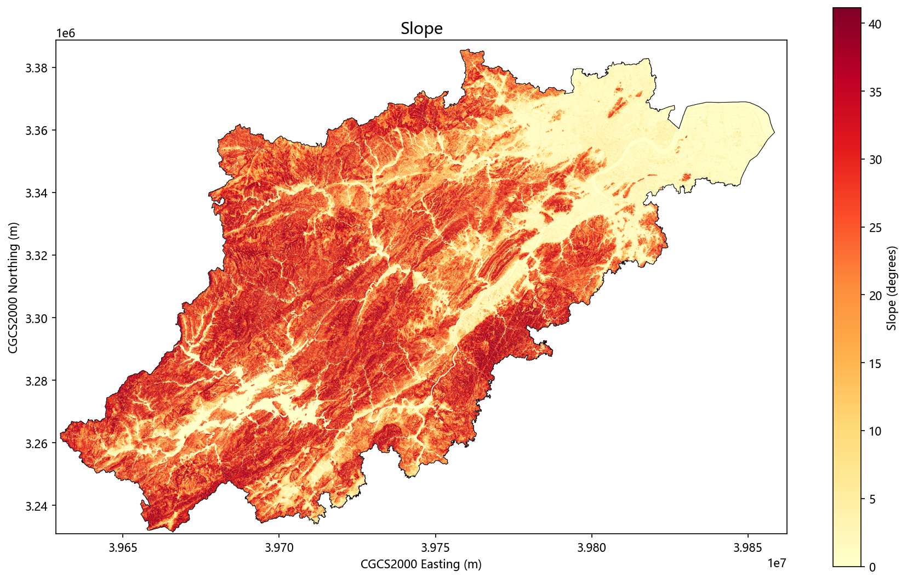

# 杭州市 DEM 地形分析与栅格数据标准化处理

基于 30m 分辨率 Copernicus DEM 的完整地形分析项目 —— 从数据下载到 GeoServer 地图服务发布的端到端 GIS 工程实践。

## 项目概述

以 Copernicus DEM GLO-30（ESA 免费开放数据）为数据源，对杭州市全域进行系统的地形因子提取与分级，产出 9 个栅格产品、6 张专题地图、1 份 Excel 统计报告，并通过 GeoServer 发布 WMS/WCS/WFS 标准 OGC 服务。

## 功能模块

| 步骤 | 脚本 | 功能 |
|------|------|------|
| 01 | `scripts/01_数据获取.py` | 从 AWS Open Data 在线下载 Copernicus DEM 瓦片并拼接 |
| 02 | `scripts/02_预处理.py` | 重投影到 CGCS2000 (EPSG:4527)、30m 重采样、填洼处理 |
| 03 | `scripts/03_地形分析.py` | Horn 1981 坡度坡向 + Hillshade + TRI 起伏度 + TPI 地形位指数 |
| 04 | `scripts/04_地形分级.py` | 高程 6 级、坡度 6 级、TPI 7 级分类（地貌图/水土保持规范） |
| 05 | `scripts/05_入库.py` | raster2pgsql 栅格入库 + geopandas 矢量入库 → PostGIS |
| 06 | `scripts/06_服务发布.py` | GeoServer REST API 自动发布 WMS/WCS/WFS |
| 07 | `scripts/07_出图报告.py` | 6 张专题地图 + Excel 统计报告 + JSON 摘要 |

## 核心算法

| 分析 | 算法 | 说明 |
|------|------|------|
| 坡度/坡向 | Horn (1981) | 3×3 移动窗口，8 邻域加权差分 |
| 山体阴影 | Hillshade | 光源方位角 315°（西北），高度角 45° |
| 地形起伏度 | Riley et al. (1999) TRI | 3×3 窗口中心像元与邻域的 RMS 差异 |
| 地形位指数 | Weiss (2001) TPI | 300m 半径邻域均值偏差，7 级地貌分类 |
| 高程分级 | 1:100 万地貌图规范 | 平原 / 台地 / 丘陵 / 低山 / 中山 / 高中山 |
| 坡度分级 | 水土保持规范 | 平坦(<2°) / 微坡(2-5°) / 缓坡(5-15°) / 中坡(15-25°) / 陡坡(25-45°) / 极陡坡(>45°) |

## 研究区概况

| 指标 | 数值 |
|------|------|
| 高程范围 | -5 ~ 1,779 m |
| 平均高程 | 273 m |
| 平均坡度 | 18.5° |
| 平原占比（<50m） | 20.9% |
| 山区占比（>200m） | 51.0% |
| 平坦区（<2°） | 17.2% |
| 陡坡区（>25°） | 36.5% |

## 预览

| DEM + 山体阴影 | 坡度图 |
|:---:|:---:|
|  |  |

## 项目结构

```
├── screenshots/           ← 成果预览图（2 张关键图）
├── scripts/               ← 全部 Python 脚本（01-07）
├── 原始数据/              ← 杭州市边界 GeoJSON（含 EPSG:4326 / EPSG:4527）
├── 成果展示/              ← 6 张 150dpi PNG 专题图
├── 成果数据/              ← terrain_summary.json（统计摘要）
├── 分析报告/              ← DEM地形分析报告.xlsx（4 个 Sheet）
├── requirements.txt       ← Python 依赖
└── README.md
```

## 技术栈

- **Python**：rasterio / geopandas / numpy / matplotlib / openpyxl / requests
- **算法**：GDAL 底层（Horn 坡度坡向、TRI、TPI、填洼）
- **数据库**：PostgreSQL + PostGIS + PostGIS Raster（栅格瓦片 100×100）
- **地图服务**：GeoServer（WMS/WCS/WFS/REST API）
- **坐标系统**：CGCS2000 / 3-degree GK CM 120E (EPSG:4527)

## 快速开始

```bash
# 1. 安装依赖
pip install -r requirements.txt

# 2. 配置环境变量（PostGIS + GeoServer 密码）
export PGPASSWORD=your_db_password
export GEOSERVER_PASSWORD=your_geoserver_password

# 3. 按顺序运行
cd scripts
python 01_数据获取.py
python 02_预处理.py
python 03_地形分析.py
python 04_地形分级.py
python 05_入库.py
python 06_服务发布.py
python 07_出图报告.py

# 4. 查看成果
# 浏览器打开  http://localhost:8080/geoserver  → 查看 WMS/WCS/WFS
# 打开 成果展示/  查看 6 张专题图
# 打开 分析报告/DEM地形分析报告.xlsx  查看统计报告
```

## 成果展示

打开 `成果展示/` 查看专题图：

1. `01_dem_hillshade.png` — 高程渲染 + 山体阴影叠加
2. `02_slope.png` — 坡度图
3. `03_aspect.png` — 坡向图
4. `04_tri.png` — 地形起伏度 (TRI)
5. `05_elevation_zones.png` — 高程分级图（6 级）
6. `06_slope_zones.png` — 坡度分级图（6 级）

## 服务端点

```
WMS: http://localhost:8080/geoserver/hangzhou_terrain/wms
WCS: http://localhost:8080/geoserver/hangzhou_terrain/wcs
WFS: http://localhost:8080/geoserver/hangzhou_terrain/wfs
```

## 演示亮点

1. 打开 `成果展示/01_dem_hillshade.png` → 展示 DEM + Hillshade 叠加效果
2. 打开 `分析报告/DEM地形分析报告.xlsx` → 4 个 Sheet：项目概览、统计摘要、地形分级、方法说明
3. 浏览 `scripts/03_地形分析.py` → 讲解 Horn 算法 / TRI / TPI 的地学意义
4. 运行 `python scripts/06_服务发布.py` → 演示 REST API 一键发布 10 个图层到 GeoServer
5. 打开 `http://localhost:8080/geoserver` → 查看 WMS/WCS/WFS 三大标准服务
6. 在 QGIS 中加载 WMS → 验证栅格 + 矢量图层叠加显示

## 数据来源

Copernicus DEM GLO-30 (European Space Agency, 2021) — 全球 30m 分辨率数字高程模型，从 AWS Open Data 免费获取。

## License

MIT
